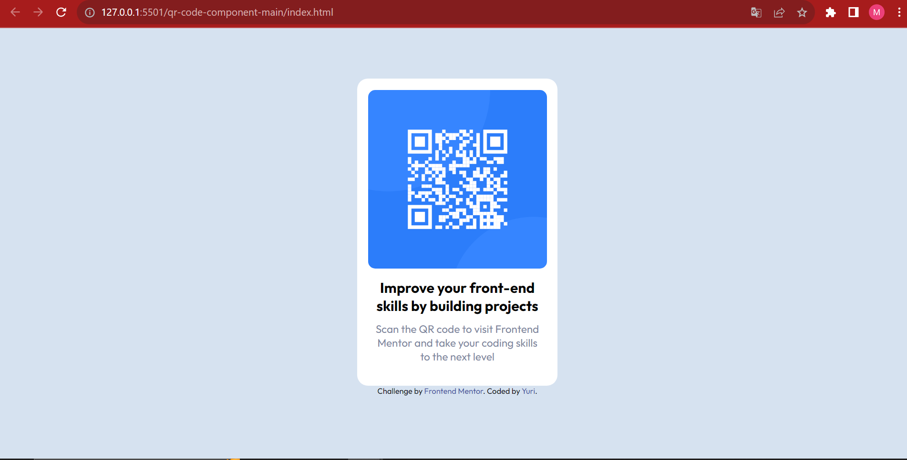
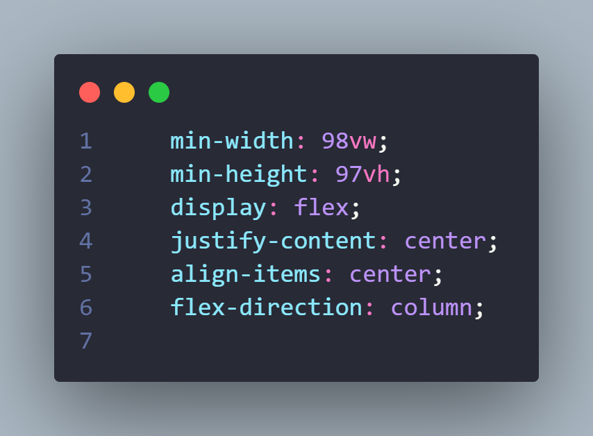

# Frontend Mentor - QR code component solution

This is a solution to the [QR code component challenge on Frontend Mentor](https://www.frontendmentor.io/challenges/qr-code-component-iux_sIO_H). Frontend Mentor challenges help you improve your coding skills by building realistic projects. 

## Table of contents

- [Overview](#overview)
  - [Screenshot](#screenshot)
  - [Links](#links)
- [My process](#my-process)
  - [Built with](#built-with)
  - [What I learned](#what-i-learned)
  - [Continued development](#continued-development)
  - [Useful resources](#useful-resources)
- [Author](#author)
- [Acknowledgments](#acknowledgments)

## Overview
hello this is my first Frontend Mentor project and it's a card with a qr code I've been studying HTML and CSS for about a month.

### Screenshot

### Links

- Solution URL: [Solution here](https://yuri151.github.io/qr-code-component-main/)

## My process
I started looking at the design to understand what had to be ugly after doing that I went to see the style-guide and the html.

I started to make the html with all the necessary elements for the project as soon as the html was structured I went to the style leaving things beautiful I called the main selectors of the project as: font-family font-size and I imported the font inside others then I centralized the elements and organized the proportion of the div box and elements as the img I finished adding the colors.

average time to complete the project was: 1h 30

### Built with

- Semantic HTML5 markup
- CSS custom properties
- Flexbox

### What I learned
I am proud of this part of the code because I was having a lot of difficulty centering the elements because I was using the flexbox of the body and it was not working so I understood that in a div it worked normally and I arrived at this solution

CSS

### Continued development

what I want to continue learning and testing would be the display: flex

### Useful resources

- [Flexbox](https://www.w3schools.com/css/css3_flexbox.asp) - this helped to align the page elements.

## Author
- Frontend Mentor - [@Yuri](https://www.frontendmentor.io/profile/yuri151")
